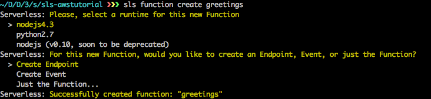
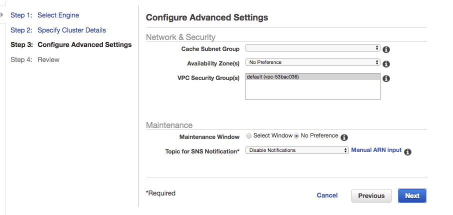

# AWS Pop-up Loft Workshop
# Designing and managing scalable APIs with AWS and 3scale

This workshop is jointly delivered between Amazon Web Services (AWS) and the AWS Advanced Technology partner 3scale API Management Platform. Together we provide a full complement API program management solution that integrates 3scale with the Amazon API Gateway and Lambda.

The workshop is held at the AWS Pop-up Loft London on April 25th, 9:00AM - 1:00PM. The workshop description can be found [here](https://awsloft.london/session/2016/fd3f2e85-b292-44cd-867d-2c0528cbd741).

This part of the tutorial focuses on how the [integration](https://www.3scale.net/amazon-gateway-integration/) between 3scale, Amazon API Gateway and Lambda can be achieved practically.

## Table of Contents
`TODO: Manfred to update at the end`

* Intro to [3scale](https://www.3scale.net/) API Management ([Jump to section](#intro))
* Goals of this tutorial ([Jump to section](#goals))
* Prerequisites for this tutorial ([Jump to section](#prerequisites))
* Setting up the Amazon Virtual Private Cloud (VPC) ([Jump to section](#vpc))
* Setting up Elasticache ([Jump to section](#elasticache))
* Creating the Lambda code ([Jump to section](#lambda))
* Intro to the Amazon API Gateway [custom authorizer](http://docs.aws.amazon.com/apigateway/latest/developerguide/use-custom-authorizer.html#api-gateway-custom-authorization-overview) principles ([Jump to section](#authorizer))
* Create and deploy the 3scale-specific custom authorizer ([Jump to section](#deploy))

<a name="intro"></a>
## Intro to 3scale API Management
3scale makes it easy to open, secure, manage, distribute, control, and monetize your APIs. Built with performance, customer control and excellent time-to-value in mind, no other solution gives API providers so much power, ease, flexibility and scalability in such a cost effective way. Check it out at https://www.3scale.net

3scale’s API Management Platform also supports the unique requirements of delivering APIs on the Amazon Web Services (AWS) infrastructure stack -- fexibly, at scale and with great RoI. API providers on AWS don’t have to switch solutions to get Amazon API gateway features like distributed denial-of-service (DDoS) attack protection, caching and logging. Plus, adding 3scale provides rich, sophisticated API management business operations for fine-grained API control and visibility, as well as features for API adoption and promotion. Check out the details about this [integrated solution](https://www.3scale.net/amazon-gateway-integration/).


<a name="goals"></a>
## Goals of this tutorial
You've seen the importance of API management when you are developing and exposing APIs. In this tutorial we will show how to add an API management layer to your existing API.

For this tutorial you will use:

* Amazon API Gateway: for basic API traffic management
* AWS Lambda: for implementing the logic behind your API
* Elasticache: for caching API keys and improving performance
* VPC: for connecting AWS Lambda with Elasticache
* Serverless framework: for making configuration and deployment to Lambda a lot easier
* 3scale API management platform for API contracts on tiered application plans, monetization, and developer portals with interactive API documentation

Below are two overview diagrams that describe the various components involved and their interactions. The first diagram shows what happens when a certain API endpoint is called for the first time togehter with a certain API key.

<a name="firstcall"></a>


Here is the flow for the first call:

1. Amazon API Gateway checks the 3scale custom authorizer if this call is authorized.
2. The 3scale custom authorizer checks if the authorization info is stored in the cache.
3. Since it is the first call, there is no info stored in the cache. So, the 3scale custom authorizer queries the 3scale API Management platform, which returns whether this call is authorized or not.
4. The 3scale custom authorizer updates the cache accordingly.
5. The 3scale custom authorizer returns the authorization response to the Amazon API Gateway.
6. If the call was positively authorized, the Amazon API Gateway directly queries the API backend, which in our case is a Lambda function.

The second diagram below shows what happens at every subsequent request to the same  API endpoint with the same API key.

<a name="subsequentcalls"></a>


Here is the flow for every subsequent call:

1. Amazon API Gateway checks the 3scale custom authorizer if this call is authorized.
2. The 3scale custom authorizer checks if the authorization info is stored in the cache. Since other calls have previously been executed, the cache has the authorization info stored.
3. The 3scale custom authorizer returns the authorization response to the Amazon API Gateway.
4. If the call was positively authorized, the Amazon API Gateway directly queries the API backend, which in our case is a Lambda function.
5. The 3scale custom authorizer calls the 3scale Async Reporting Function.
6. The 3scale Async Reporting Function reports the traffic back to the 3scale API Management platform, which is used for API analytics.

<a name="prerequisites"></a>
## Prerequisites for this tutorial
* 3scale account -- sign up at [3scale.net](https://www.3scale.net/aws-loft/ )
* AWS account -- sign up at [aws.amazon.com](http://aws.amazon.com)
* AWS command line interface (CLI) installed locally -- ([Instructions](http://docs.aws.amazon.com/cli/latest/userguide/cli-chap-welcome.html))
* Node.js environment installed locally -- ([Instructions](https://docs.npmjs.com/getting-started/installing-node))
* Serverless framework installed locally -- ([Instructions](https://github.com/serverless/serverless))

<a name="principles"></a>
## Intro to the Amazon API Gateway custom authorizer principles
With the Amazon API Gateway custom authorizer, you can control access to your APIs using bearer token authentication strategies, such as OAuth or SAML. To do so, you provide and configure a custom authorizer (basically your own Lambda function) for the Amazon API Gateway, which is then used to authorize the client requests for the configured APIs. You can find all the details how to do this in a dedicated Amazon API Gateway [tutorial](http://docs.aws.amazon.com/apigateway/latest/developerguide/use-custom-authorizer.html).

In the next section, we describe the our custom authorizer that we wrote to authorize API calls against the 3scale API Management platform.

## (Optional) Create an API and deployed it to Amazon API gateway
If you don't yet have an API deployed on Amazon API gateway you can create one very easily using the [Serverless](https://github.com/serverless/serverless) framework. `sls` is the Serverless CLI which you should have installed on your system as part of the prerequisites of this tutorial.

Follow the following steps:

1. Create a project: `sls create project`
2. Create a function: `sls function create greetings` (This will create a `greetings` folder.)

3. Check if it's working and the result of an API call by locally running:  `sls function run`.
4. Finally deploy this endpoint using: `sls dash deploy`


If it succeeded it should give you the URL of the API created.
We will use this API during the rest of our tutorial.

<a name="vpc"></a>
##Setting up the Amazon Virtual Private Cloud (VPC)
To reduce latency and have an API stack that is capable of handling the load of thousands of requests, we will use [Amazon Elasticache](https://aws.amazon.com/elasticache/). There we will store API keys that were authorized to make request to the API (see the descriptions and diagrams [above](#goals)). This will help reducing the number of calls to the main 3scale platform and consequently improve the overall API stack performance.

Elasticache is only available through the [Amazon Virtual Private Cloud](https://aws.amazon.com/vpc/) (VPC). To be able to use Elasticache with Lambda, the Lambda function has to be on the same VPC.

Our 3scale custom authorizer function will make calls to the 3scale API management platform, which is outside of the VPC. We will now configure the VPC to make sure it can connect to the internet, outside of VPC.

If don't have a VPC, create one first and then follow these steps:

1. Go to ... `TODO: nico add where to go` You can use the default one.
2. Create a new subnet
3. Create a NAT gateway and attach it to the previously created subnet
4. Create a new route table.
5. Once the route table is created, edit the routes. 
Point `0.0.0.0/0` to the NAT gateway you created earlier.

6. Attach this rule to at least two subnets in your VPC. For this, select an subnets that are not the ones attached to the NAT gateway.

7. Select the route table you just created on the route tables tab.

And that's it for the VPC part.
You know have a VPC, that's know connected to the Internet. We will see later how to put Elasticache and Lambda on this VPC.

`TODO: nico add screenshot showing where in the console a user has to configure this.`

<a name="elasticache"></a>
##Setting up Elasticache

[Elasticache](https://aws.amazon.com/elasticache/) is a service offered by AWS to cache data simply and access it quickly. It supports both Memcached and Redis. In our example we will use Redis.

Follow these steps:

1. Go on Elasticache section in your AWS console.
2. Create a Redis cluster under the VPC you defined before.
3. Uncheck replication box
4. Change Node type to `cache.t2.micro`  (eligible for free tier).


5. On the next step, select your VPC and launch the cluster.



There is no more setup to do on the Elasticache cluster.

Once the cluster is ready, go on the node 
created, and get the Endpoint URL. We will need it later on in the tutorial.

<a name="lambda"></a>
##Creating Lambda code for the custom authorizer
We will now work on the code for the Lambda function that represents the custom authorizer. This Lambda function will call the 3scale API Management platform to check if a call to the API is authorized.

We are using the Serverless framework, which is a great way to deploy Lambda functions easily. If you are not familiar with it, check their [site](http://serverless.com). It's basically a tool that helps you manage Lambda functions easily.

Follow these steps to get the Lambda function that represents the 3scale custom authorizer up and running:

1. Clone [this repo](https://github.com/picsoung/awsThreeScale_Authorizer) locally using the following commands:
	```
	git clone https://github.com/picsoung/awsThreeScale_Authorizer
	cd awsThreeScale_Authorizer
	```

2. In the `awsThreeScale_Authorizer` folder you will see two different folders, which represent the two Lambda function we are going to use:
* `authorizer` is the Lambda function that is called by the Amazon API Gateway to authorize incoming API calls (see the [first diagram above](#firstcall)).
* `authrepAsync` is called by the `authorizer` function to sync with the 3scale API Management platform for API traffic reporting and analytics (see the [second diagram above](#subsequentcalls)).

Before deploying this to AWS we need to complete a few more tasks.

1. Init serverless project with `sls project init`


2. In `awsThreeScale_Authorizer` folder and on each function folder run the `npm install` command. This will install all the NPM plugins needed.

The logic of each Lambda function is kept in the `handler.js` file but we don't have to touch it. If you look at the code in this file you will see that we are using environment variables. So, let's set them up:

1. Go to the `authorizer` folder
2. Open the `s-function_example.js` file and rename it to `s-function.js`
3. Modify the placeholder with your own values under `environment` section.

```
"environment": {
	"SERVERLESS_PROJECT": "${project}",
	"SERVERLESS_STAGE": "${stage}",
	"SERVERLESS_REGION": "${region}",
	"THREESCALE_PROVIDER_KEY":"YOUR_3SCALE_PROVIDER_KEY",
	"THREESCALE_SERVICE_ID":"YOUR_3SCALE_SERVICE_ID",
	"ELASTICACHE_ENDPOINT":"YOUR_ELASTICACHE_ENDPOINT",
	"ELASTICACHE_PORT":6379
}
```

You can find `YOUR_3SCALE_PROVIDER_KEY` under `Accounts` tab in your 3scale account on the 3scale portal.


You can find `YOUR_3SCALE_SERVICE_ID` under the `APIs` tab.


For the `YOUR_ELASTICACHE_ENDPOINT`, go on your AWS console and click on the cluster you have created before. There you will see the endpoint URL.


3. In the `s-function.json` file for `authorizer function` you will see a `SNS_TOPIC_ARN` property. Leave it like it is for now, we will come back to it later.
4. In the `s-function.json` you have a `vpc` section, too. Replace it with the securitygroup and the subnets we have created before. The VPC section should look like this now:

	```
	"vpc": {
	    "securityGroupIds": ["ID_OF_SECURITY_GROUP"],
	    "subnetIds": ["ID_OF_SUBNET","ID_OF_ANOTHER_SUBNET"]
	    }
	```
This part of the configuration assigns a VPC to the Lambda function, so it can communicate with Elasticache.

Repeat those steps on `authrepSync` folder too.

We are now done with the settings of our Lambda functions that represent the 3scale custom authorizer.

Now finally, let's deploy these two Lambda functions using Serverless again:
`sls dash deploy`

Next, select both functions and then select deploy.


<a name="authorizer"></a>
## Add custom authorizer to API Gateway
We are now going to add the custom authorizer functions we just deployed to our existing API on the API Gateway.

To do so: go to the API Gateway console and select your API. You should see a section named `Custom Authorizers` on the left menu. Click on it.

1. Click on `Create` button to create your custom authorizer.
2. Name it `threescale`.
3. Choose the region where your Lambda has been deployed, and look for the authorizer function you have deployed earlier. (`sls-threeScale-Authorizer-authorizer`)
4. Under `Identify token source` modify it to `method.request.header.apikey`. It means that we are expecting developers to make a call to our API with a header `apikey`, and we will use this key to authenticate the request.
5. Finally change TTL to 0. The authorizer is already handling caching.

We now have a custom authorizer. We now have to apply it to our API endpoints.

Go on the `Resources` part of your API.
Select a method, and click on the `method request` box.
There you should change `Authorization` to the custom authorizer you have created before.
Once you are done, save, and re-deploy your API.


You would have to reproduce these steps on each endpoint of your API to make sure all your API is secured. But for now we can limit it to a single endpoint.

## Test integration

You are almost done!
We now need to test that everything worked as planned.

You need to go to your 3scale account to find a valid API key.
Once you are in your 3scale dashboard go under `Applications` section and click on the default application named `	Developer's App`.


On the next screen you see details of this application like on which plan it is, the traffic over the 30 days....

We can look at those features later, now we are only interested by the `User Key` part, copy it.


We will now make a call to your API on the endpoint where we setup the custom authorizer using the API key we got from 3scale to authenticate ourselves.

Open a Terminal command an run the following command

```
curl -X http://YOUR_API_GATEWAY_URL/YOURENDPOINT \
	-H 'apikey: 3SCALE_API_KEY'
```

If all worked as planned you should see the result of your API call.
Now let's try with a non valid Key, replace the key with any random string.
See? It does not work.

Your API is now protected and only accessible to people with an API key.

## Finishing up integration using SNS
The Authorizer function will be called every time a request comes on the API Gateway. We don't want to have to call 3scale every time to check if key is authorized or not.
That's where Elasticache will become handy.
The first time we see an API key we will ask 3scale to authorize it. We then store the result in cache so we can serve it next time the key is making another call.
We will then use the `authRepAsync` function to sync cache with the 3scale platform.

This `authRepAsync` function will be called by the main `authorizer` function using SNS protocol.
SNS is a notification protocol available on AWS. Lambda functions could subscribe to a specific topic. And every time a message is sent on this topic the Lambda function will be triggered.

### Create a SNS topic#
In your AWS console, go under SNS service.
Create a new topic name it `threescaleAsync`.
Once created click on this new topic.

There click create subscription button.
Select `AWS Lambda` as protocol.
Find the `authRepAsync` function in the endpoint menu.
And keep `default` as a version.


Now, we have `authRepAsync` Lambda that is subscribed to this topic.

Keep the ARN of this topic handy.


### Attach policy to Lambda function
To be able to send SNS message to a topic a Lambda needs to have the correct policy.
You could achieve that adding the following policy

```
{
	"Effect": "Allow",
	"Action": [
		"sns:Publish"
	],
	"Resource": [
		"YOUR_SNS_TOPIC_ARN"
	]              
}
```
at the root of your project under in the `s-ressources-cf.json` file.

Replace `YOUR_SNS_TOPIC_ARN` placeholder with the ARN of the topic we previously created.

### Send SNS message to this topic
In your Serverless code it's time to update the `s-function.json` file for `authorizer` function.
There replace on the line `  "SNS_TOPIC_ARN":"YOUR_SNS_TOPIC"`
replace `YOUR_SNS_TOPIC` by the ARN of the SNS topic you just created.

Check in the `handler.js` file how we are sending the message.

You can now redeploy your function and ressouces.

```
sls resources deploy
sls dash deploy
```

Caching should now work.
To see if it works you can look at the logs of the `authRepAsync`Lamba function.
